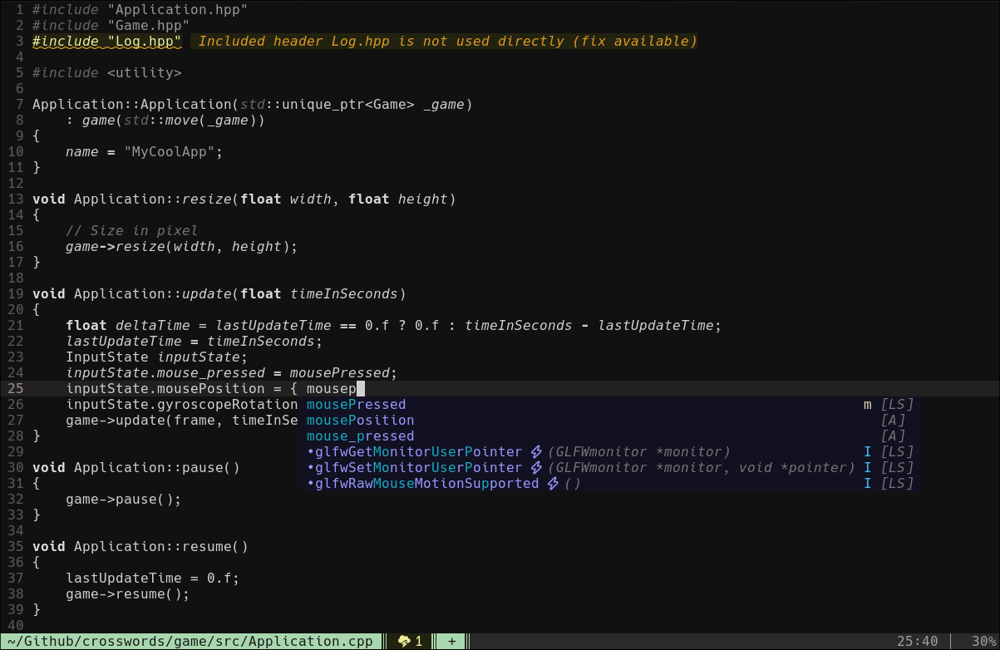

# Humdrum

A quiet Vim colorscheme for people who like their editor a little dull.

Humdrum splits the world in two: code is rendered almost completely
desaturated, while interactive messages use color for warnings, errors,
highlights, completion, and other editor feedback. The result is a simple
visual hierarchy instead of color anarchy.

It includes dark and light variants, lightline support, and a few practical
plugin highlights.

Plugin support follows what I use day to day, and contributions are welcome.



## Install

With vim-plug:

```vim
Plug 'xpac27/humdrum.vim'
```

Then:

```vim
colorscheme humdrum
```

## Light Mode (WIP)

Humdrum follows Vim's `background` option:

```vim
set background=light
colorscheme humdrum
```

Use `set background=dark` for the default dark palette.

## Options

```vim
let g:humdrum_emphasize_comments = 1
let g:humdrum_emphasize_whitespace = 1
```

Both default to `0`.

## Inspiration

Humdrum is inspired by [vim-monotone](https://github.com/Lokaltog/vim-monotone).
